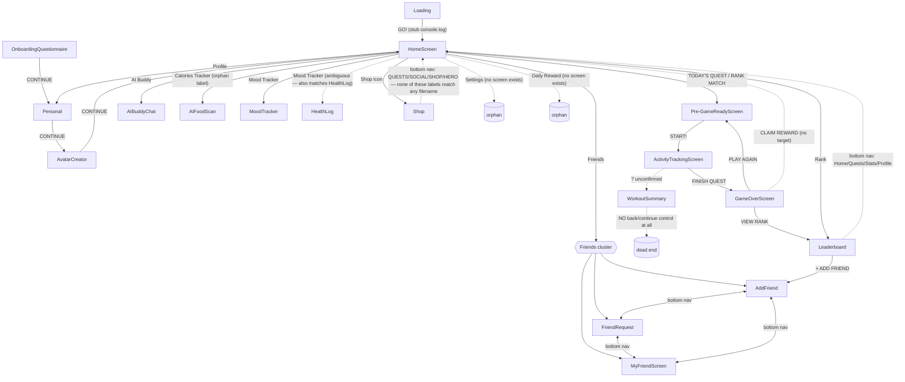

# FitQuest Design Audit

Audit of all 18 static HTML mockups in `design/`. Each screen was generated independently (each file re-declares its own full Tailwind config + color tokens from scratch), which is the root cause of almost everything below: the *palette* mostly matches across files, but naming, structure, and navigation drifted because nothing was ever shared between prompts.

**Method:** every file was read in full. No file contains a working link — every button/nav item is either `href="#"`, has no `onclick`, or has no navigation attribute at all. All destinations below are *inferred* from labels/icons/context, not from code.

## Screen inventory

| File | Screen | Role |
|---|---|---|
| Loading.html | Splash screen | App entry |
| OnboardingQuestionnaire.html | Onboarding step 1/5 — goal picker | Onboarding |
| Personal.html | Onboarding step 2/5 — height/weight ("YOUR STATS") | Onboarding |
| AvatarCreator.html | Avatar customization | Onboarding (step 3?) |
| HomeScreen.html | Main hub/dashboard | Core |
| Pre-GameReadyScreen.html | "Rank Match" countdown/ready screen | Core loop |
| ActivityTrackingScreen.html | In-progress "Activity Quest" (calorie burn) | Core loop |
| GameOverScreen.html | Post-session results modal | Core loop |
| WorkoutSummary.html | Shareable summary card | Core loop |
| AIBuddyChat.html | Chat with AI coach | Feature |
| AIFoodScan.html | Camera food/calorie scanner | Feature |
| MoodTracker.html | Mood check-in + diary + calendar | Feature |
| HealthLog.html | **Same content as MoodTracker.html** (see finding #1) | Feature (duplicate) |
| Shop.html | Cosmetics store | Feature |
| Leaderboard.html | Global/friends XP ranking | Social |
| AddFriend.html | Search/add friends | Social |
| FriendRequest.html | Pending friend requests | Social |
| MyFriendScreen.html | Friends roster | Social |

## Connection diagram

Edges are inferred (dashed-in-spirit) since no file contains real navigation code. Three separate, mutually-inconsistent bottom-nav bars are called out explicitly.

**Three incompatible bottom navigation bars found** (confirmed by direct grep, not just inference):

| Screen(s) | Tab bar items (in order) |
|---|---|
| HomeScreen.html (mobile) | Home · Workout · Track · Shop · Profile |
| Leaderboard.html | Home · **Quests** (mis-highlighted as active, see finding #4) · **Stats** (no matching screen) · Profile |
| Shop.html | **QUESTS** · **SOCIAL** · SHOP · **HERO** |
| AddFriend / FriendRequest / MyFriendScreen | ADD FRIENDS · FRIEND REQUESTS/REQUESTS · MY FRIENDS |

A real app can only have one global tab bar. Right now there are four different item sets, and Shop's/Leaderboard's don't even use vocabulary ("Social", "Hero", "Stats") found anywhere else in the file set — someone building the real nav has to invent a canonical 1-of-N structure from scratch.

## Findings

### Critical — content collisions & dead ends

1. **`HealthLog.html` and `MoodTracker.html` are the same screen.** `HealthLog.html`'s `<title>` and `<h1>` both read "Mood Tracker" — it has no health-log content (no sleep/water/weight/medication). Either this is an accidental duplicate export, or `HomeScreen`'s "Mood Tracker" link is meant to point at one of these two files while the other is orphaned. Pick one; delete/repurpose the other before this reaches implementation.
2. **`WorkoutSummary.html` has no way to leave.** Every other end-of-flow screen (GameOverScreen) has at least a couple of buttons; this one has a single Share icon and no back/close/continue control at all — a genuine dead end in the flow, not just an unwired button.
3. **No screen exists for several implied destinations**: "Settings" (linked from HomeScreen sidebar, AIBuddyChat, AIFoodScan, MoodTracker/HealthLog headers), "Daily Reward" (HomeScreen), "Stats" (Leaderboard bottom nav), IAP currency purchase / shopping basket / checkout (Shop.html). These are referenced by icon/label but nothing in the 18 files implements them.
4. **Leaderboard's own bottom nav doesn't represent Leaderboard.** The active/highlighted tab is "Quests," not any Ranking/Leaderboard tab — because no such tab exists in that nav at all. Reads like the nav bar was copy-pasted from a Quests screen without updating the active state.

### High — inconsistent design tokens (the "junior + AI, one screen at a time" signature)

5. **The brutalist border/shadow motif has six different class names for one visual effect** (3px solid border + 4px/4px offset hard shadow + "press" active state): `.chibi-border`/`.chibi-shadow` (Leaderboard, MyFriendScreen, Shop), `.brutal-border`/`.brutal-shadow` (MoodTracker, WorkoutSummary), `.hard-shadow` (AddFriend, GameOverScreen, Personal), `.retro-border`/`shadow-retro` (Pre-GameReadyScreen), `.brutalist-shadow`/`.brutalist-button` (OnboardingQuestionnaire), plus AvatarCreator which uses no class at all (raw arbitrary Tailwind values). Same design, six vocabularies — direct evidence nothing was shared across prompts.
6. **"Ink black" has three different literal values** for what's meant to be one brand constant: `#1c1b1b` (most files), `#1A1A1A` (ActivityTrackingScreen, MoodTracker, FriendRequest, Personal, WorkoutSummary), and `rgba(28,27,27,1)` (AvatarCreator, AIBuddyChat) — the last one is numerically identical to `#1c1b1b` but written a third way.
7. **The "off-white" background has two competing values inside the *same* Tailwind config** in multiple files: the declared token is `background: #fcf9f8`, but `<body>` is then hardcoded to `#F8F7F2` via a separate inline `<style>` block that overrides it — seen in Leaderboard, MoodTracker, HealthLog, FriendRequest, MyFriendScreen, Personal. ActivityTrackingScreen goes further and redefines the *token itself* to `#F8F7F2` with a comment admitting it: `/* Overridden based on prompt */`.
8. **Google Fonts are loaded with different weight ranges per screen** for the same three families (Space Grotesk / Hanken Grotesk / JetBrains Mono) — e.g. AIBuddyChat only loads Space Grotesk 700, AIFoodScan loads 300–700 plus full italic ranges, WorkoutSummary loads the full 100–900 range. Screens will render visibly different font weights for identically-named text styles.
9. **Loading.html is a total stylistic outlier**: it's the only screen using pixel font `Press Start 2P`, has no Material Symbols icons (raster images + a bare emoji instead), and doesn't share the Material-3 color token structure at all. If this is the real splash screen, it doesn't visually match anything the user lands on next.
10. **Material Symbols icon fill (`FILL 0` vs `FILL 1`) is applied ad hoc**, not by a consistent rule — inconsistent even within single files (e.g. HomeScreen fills some nav icons and not others with no visible logic).
11. **The Material Symbols Outlined `<link>` tag is duplicated verbatim in every single file** (fetches the same stylesheet twice) — a copy-paste artifact repeated 18/18 times.

### Medium — structural / component inconsistencies

12. **Three unrelated onboarding-progress-stepper implementations**: dots (OnboardingQuestionnaire's `.step-node`/`.step-line`), a bar+checkmark (Personal), and no equivalent component reused between them despite representing the same 5-step flow.
13. **Fixed pixel-dimension frames mixed with fluid layouts**: Personal.html is hardcoded to `w-[390px] h-[930px]`, Pre-GameReadyScreen to `h-[850px]`, WorkoutSummary's card to `h-[700px]`, while AddFriend/OnboardingQuestionnaire/MyFriendScreen use responsive `min-h-screen`/fluid layout. These won't compose into one consistent responsive app.
14. **Button shape language is inconsistent**: back buttons are `rounded-full` (pill) in AIBuddyChat/AIFoodScan but `rounded-lg` (rectangular) in ActivityTrackingScreen for the identical "go back" action.
15. **Same destination, different icon glyph**: Shop is reached via `storefront` (HomeScreen sidebar) and `shopping_bag` (HomeScreen bottom nav / Shop.html itself) — two icons for one place.
16. **Nav label vs. filename mismatch**: bottom-nav/sidebar label "Profile" almost certainly targets `Personal.html`, but nothing ties the two names together; a future developer has to guess.
17. **Broken/non-existent Tailwind utility classes shipped as real code**: `text-headline-md-mobile` in Shop.html is used but never defined in that file's own `fontSize` config (silently no-ops); `class="... flat no shadows ..."` appears literally inside `class=` attributes in AIFoodScan.html and FriendRequest.html — these are not real utilities, they read like a stray design note that leaked into the markup.
18. **Systemic accessibility gap**: nearly every image across all 18 files uses a non-standard `data-alt` attribute (holding the actual descriptive text, e.g. the original AI image-gen prompt) while the real `alt` attribute is missing, generic ("Avatar"), or much shorter — screen readers get little to nothing.

### Low — content/copy nits

19. **Title vs. on-screen heading mismatch**: `AIFoodScan.html`'s `<title>` says "Food Scanner" but its visible `<h1>` says "Calories Tracker" — HomeScreen's "Calories Tracker" link target is ambiguous as a result.
20. **Inconsistent casing for the same data point**: GameOverScreen shows "Score : 4,000" (title case) in one place and "SCORE 4,000" (all caps) in another for the identical value.
21. **Same character images, different alt-text detail/wording** between Shop.html and WorkoutSummary.html despite reusing the exact same asset URLs (e.g. "Cute pixel art pet cat" vs. "Tuxedo Cat Pet").
22. **Decorative icon misuse**: `arrow_back_ios_new` (a navigation icon) is reused purely as a decorative flourish around headings in Leaderboard and GameOverScreen; HomeScreen's "sparkle" decorations are tagged `data-icon="sparkles"` but actually render `arrow_back_ios_new` (not a real Material Symbol name) — likely renders as a stray back-arrow rather than a sparkle.

## Recommendation

Before implementation, someone should:
1. Resolve the HealthLog/MoodTracker collision (finding #1) — pick one file, delete the other.
2. Decide the **one** canonical bottom-tab-bar structure (items, order, icons) and retrofit every screen to it, rather than inventing a new one implicit in each mockup.
3. Extract the shared token set (colors, fonts, radii, the brutalist border/shadow pattern) into one real source (e.g. a Tailwind config or design-token file) instead of each screen re-declaring and drifting.
4. Add the missing screens implied by existing links (Settings, Daily Reward claim, Shop checkout/basket) or remove those affordances from the mockups.
5. Give `WorkoutSummary.html` an exit path.
